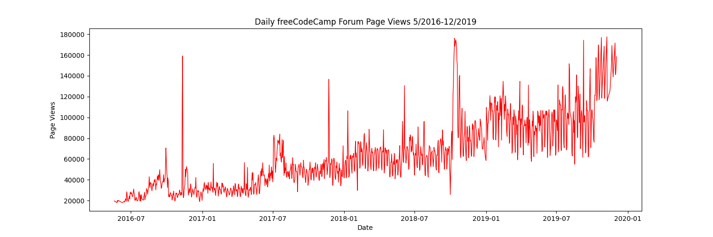

<h1 align="center">📈 Page View Time Series Visualizer</h1>

<div align="center">
  
  
  
  
</div>

<br>

## 📝 Overview
This project is part of the **Data Analysis with Python** certification from [freeCodeCamp](https://www.freecodecamp.org/). The core objective is to visualize time series data to understand patterns in visits and identify yearly and monthly growth trends on the freeCodeCamp forum from May 2016 to December 2019.

## ⚙️ Data Processing & Cleaning
Real-world data is rarely perfect. Before visualization, the dataset (`fcc-forum-pageviews.csv`) underwent a crucial cleaning process to remove outliers:
* **Quantile Filtering:** Filtered out the days when the page views were in the top 2.5% or bottom 2.5% of the dataset. This ensures that extreme spikes (e.g., server attacks, viral anomalies) or drops (e.g., downtime) do not skew the overall trend analysis.

## 📊 Visualizations

### 1. Daily Page Views (Line Plot)
A standard line chart illustrating the continuous flow of daily traffic. It highlights the overall upward trajectory of the forum's popularity over the 3.5-year period.


### 2. Average Daily Page Views by Month (Bar Plot)
A grouped bar chart displaying the average daily page views for each month, segmented by year. This visualization is highly effective for spotting year-over-year growth for specific months.


### 3. Trend and Seasonality (Box Plots)
Two adjacent box plots utilizing Seaborn to dissect data distributions:
* **Year-wise Box Plot (Trend):** Demonstrates how the median views and data variance increase year by year.
* **Month-wise Box Plot (Seasonality):** Reveals monthly behavioral patterns, such as potential dips in traffic during holiday seasons or spikes during specific academic months.


## 🚀 How to Run Locally

1. Clone the repository:
   ```bash
   git clone [https://github.com/LyNhutMinh/fcc-time-series-visualizer.git](https://github.com/LyNhutMinh/fcc-time-series-visualizer.git)
